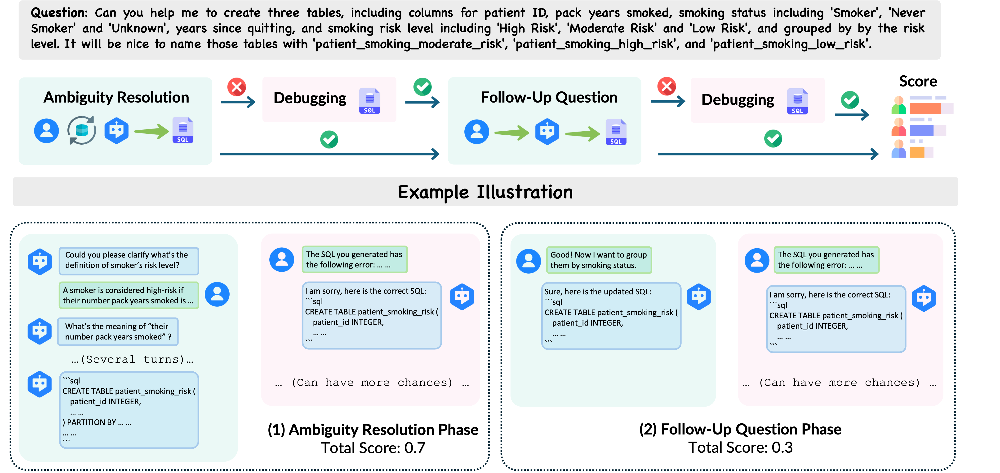

# Bird-Interact Conversational Module

This module implements the conversation-based interaction system for the BIRD-Interact project, focusing on natural language interactions with database systems.

## Overview
<p align="center">
  
</p>

**What is it?**  
A test that sees how well an evaluated system (S) can communicate with a user simulator (U) to solve user tasks via good SQL queries.

---

#### Step-by-step flow

1. **Ambiguous task**  
   *U* starts with a task with several ambiguities.

2. **Clarification round**  
   *S* can ask follow-up questions until it thinks it understands, then sends a SQL query.  
   • If the query is wrong, *S* gets one more chance (a “debugging”) to fix it.  
   • If both attempts fail, the test stops.

3. **Follow-up round**  
   If the first question was solved, *U* immediately asks a related follow-up query.  
   *S* writes a new SQL query and again has one debugging if needed.

4. **Turn limit**  
   The back-and-forth in the clarification round is limited by two things:  
   • how many ambiguity points were marked in the task, plus  
   • a small extra “user patience” (i.e., extra turns) allowance with the default being 3.

---

#### How scoring works

For a batch of tasks we count how many times *S* succeeds in each case:

| Situation | What counts as a win? | Reward added per win |
|-----------|----------------------|----------------------|
| Clarification, first try | Solved without using the debugging | **0.7** |
| Clarification, after debugging | Solved on the second try | **0.5** |
| Follow-up, first try | Solved without using the debugging | **0.3** |
| Follow-up, after debugging | Solved on the second try | **0.2** |

Add up the points and divide by the number of tasks.  
The closer the final number is to **1**, the better the system:

* High points = solves quickly with few mistakes.  
* Low points = needs debuggings or can’t solve at all.


## Directory Structure

```
bird_interact_conv/
├── code/
│   ├── sql_parser.py         # SQL query parsing utilities
│   ├── wrap_up_sql.py        # SQL query formatting and validation
│   ├── infer_api_system.py   # System-side API inference
│   ├── infer_api_user_1.py   # User simulation (first step)
│   ├── infer_api_user_2.py   # User simulation (second step)
│   ├── collect_response.py    # Response collection utilities
│   └── call_api.py           # API calling interface
├── pipeline/
│   └── run_gpt.sh         # Pipeline execution script
├── prompts/
│   └── prompts.py            # Conversation prompts and templates
├── data/
│   └── bird-interact-lite    # downloaded dataset
└── results/                  # Output directory for results
```

## Setup and Usage

### 1. Data Preparation

```bash
mkdir data
cd data
git clone https://huggingface.co/datasets/birdsql/bird-interact-lite
```

After cloning the data repository, follow these steps to prepare the dataset:

1. Copy the JSON file containing the GT fields into the `bird-interact-lite` directory
2. Run the merge script to combine the datasets:
   ```bash
   cd .. # Go back to the root directory
   python merge_datasets.py
   ```
3. Verify the merge was successful:
   ```bash
   python verify_merge.py
   ```

This process will create a unified JSONL file with GT fields that combines the original dataset with the ground truth information. Once verification is complete, you can proceed with the rest of the instructions.

### 2. Environment Setup

1. Download the database dumps:
   - Get from: [Google Drive](https://drive.google.com/file/d/1KABce6czIqL9kMyIX7i-_A0CIQoDnmyW/view)
   - Move to working directory of `../evaluation` and rename to `postgre_table_dumps`

2. Build and run Docker containers:
   ```bash
   cd ../evaluation
   docker compose up --build
   ```
   This launches two containers:
   - PostgreSQL database
   - Evaluation environment (so_eval_env)

3. To run the baseline code you need to install the following dependencies:
  ```bash
  docker compose exec so_eval_env bash
  cd bird_interact_conv
  pip install -r requirements.txt
  ```

### 3. API Configuration

You need to setup the model name (eg., **gpt-4o-2024-08-06**) with the API key in the `code/config.py` file

## Running Experiments

   ```bash
   # Run the conversation pipeline, need to set the API key in code/config.py
   cd pipeline
   # Line 12: project_root="YOUR-ROOT" should be changed to your root (for example: "/app")
   # And you may tune the parameters starting from line 8.
   bash run_gpt.sh
   ```
Output directory: `results/`


## Components

### Code Module
- `sql_parser.py`: Handles parsing and validation of SQL queries
- `wrap_up_sql.py`: Formats and finalizes SQL queries
- `infer_api_system.py`: Manages system-side conversation logic
- `infer_api_user_1.py` & `infer_api_user_2.py`: Different user simulation strategies
- `collect_response.py`: Utilities for gathering and processing responses
- `call_api.py`: Interface for API interactions

### Pipeline
The `run_gpt.sh` script orchestrates the conversation flow, managing:
- User query processing
- System response generation
- SQL query execution
- Response collection and evaluation

### Prompts
The `prompts.py` file contains templates and prompts used for:
- User query generation
- System response formatting
- SQL query construction
- Error handling and clarification

### Results
Results from conversation runs are stored in the `results/` directory.

## FAQ

### Q: Which model variable is used for user simulation?

**A:** The `US_model_name` variable is used for user simulation. In the `run_gpt.sh` script, you can see that `call_api.py` is called with `--model_name ${US_model_name}` for both "User Simulator Step 1" and "User Simulator Step 2". The `system_model_name` is used for the system agent that generates clarifying questions and SQL queries.

### Q: What are the output files in the results directory?

**A:** The results directory contains several types of files generated during the conversation and evaluation process:

#### System and User Interaction Files

* **`system_interaction_prompt.jsonl`**: Complete prompts sent to the system model at each turn
* **`system_interaction_response.jsonl`**: Raw JSON responses from the system model API
* **`system_interaction.jsonl`**: Main log file for the system's conversation history and SQL generation
* **`user_1_interaction_prompt.jsonl`**: Prompts for user simulator's encoder step (deciding how to answer)
* **`user_1_interaction_response.jsonl`**: Raw API responses from user simulator's encoder
* **`user_1_interaction.jsonl`**: Log file containing the "action" decided by user simulator's encoder
* **`user_2_interaction_prompt.jsonl`**: Prompts for user simulator's decoder step (generating natural language)
* **`user_2_interaction_response.jsonl`**: Raw API responses from user simulator's decoder
* **`user_2_interaction.jsonl`**: Log file containing final natural language responses from user simulator

#### SQL and Evaluation Files

* **`sql_results.jsonl`**: First SQL query extracted after initial ambiguity resolution
* **`sql_results_output_with_status.jsonl`**: Evaluation results with success/failure status and error messages
* **`sql_results_debug.jsonl`**: Corrected SQL query from debugging phase (if first attempt failed)
* **`sql_results_debug_output_with_status.jsonl`**: Evaluation results for debugged SQL query
* **`sql_results_fu.jsonl`**: SQL query generated for follow-up question phase
* **`sql_results_fu_output_with_status.jsonl`**: Evaluation results for follow-up SQL query
* **`sql_results_fu_debug.jsonl`**: Corrected SQL query for follow-up question debugging
* **`sql_results_fu_debug_output_with_status.jsonl`**: Final evaluation results for debugged follow-up SQL


